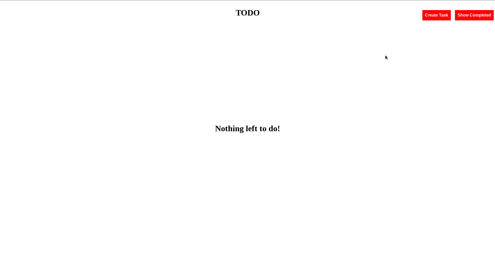
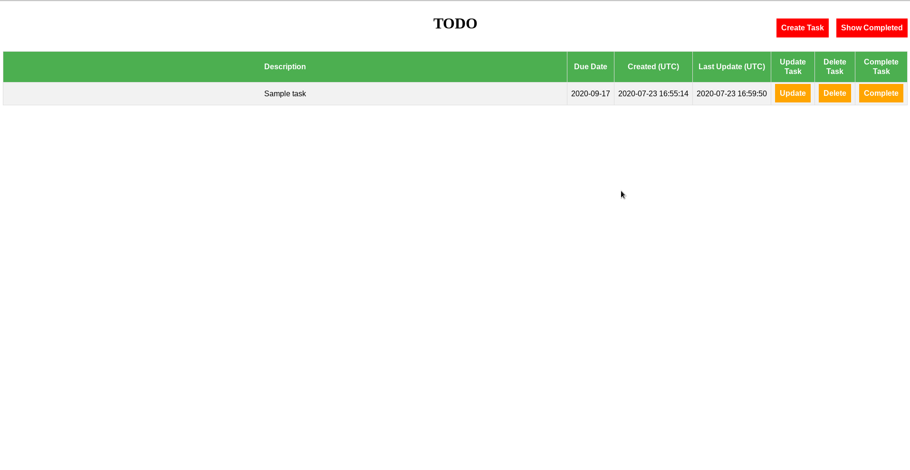

[](https://gitlab.com/gzhsuol/worky/-/jobs) [](https://gitlab.com/gzhsuol/worky/-/jobs)

# Worky
This is a TODO application that covers my specific needs, namely:
- It is a standalone application that can be deployed locally anywhere where python is installed and a browser is available (no internet required)
- Tasks are stored in a local SQLite database, meaning the application data is just a single binary file (easy backup and use, even on restrictive corporate environments)
- Every task has a deadline (otherwise it is not a TODO item)
- Tasks prioritized by deadline
- Overdue tasks highlighted and at the top
- No task categorization: tasks belonging to different projects/subjects should not be mixed in any way (the purpose of the application is to provide a prioritized list of tasks for a single project)
- Ideal for personal, day-to-day task logging and management: just pick whatever task is at the top for the current project. Just do it!
- No notifications of any kind. Don't need more food if the plate is already full
- Ideal for high context switching between projects while keeping stuff as separated as it can be
- TODO applications are personal, so this is mine

## Technologies

- Python was chosen for the backend as it can work anywhere since it is the scripting language of the day and is likely installed already where needed. If not, it's easy to install and there are portable versions which do not even require admin credentials (no IT drama)
- The frontend is HTML5 meaning that any modern browser can show it (any system will have access to a browser somewhere - famous last words?)
- SQLite was chosen to simplify backups (no database exports required, just save it as any other file) and deployments (it's just a file!)
- Having the data on a single file means you can easily have more files, so you can compartmentalize tasks by spreading them through several files and selecting which one you want to use at any given time based on the project at hand

## User manual

Just clone (or download if your machine does not have git or internet) this repository and start creating a new workfile or load an existing one. 
Launch the application with a given file with the `.worky` extension. Use separate `.worky` files for different projects as needed.

##### Preparing the environment

Make sure that at least python v3.5 is installed and in your system path, and then run:

```
python3 -m venv .env
source .env/bin/activate # On Linux
.env\Scripts\activate.bat # On Windows
```

I have chosen to use Venv instead of Pipenv as Venv comes standard with Python, and since I deal with machines with no Internet access I prefer to have as little dependencies as possible.

If the system has access to the Internet then run

```
python3 build.py --install
```

Otherwise a tar ball is provided for linux64 and another for win64 in the repository that can be installed via

```
python3 build.py --offline-install-linux64
```
which installs the dependencies at `worky_deps_manylinux1_x86_64.tar.gz` or

```
python3 build.py --offline-install-win64
```
which installs the dependencies at `worky_deps_win_amd64.tar.gz`.

These were created by running the followig commands, respectively:

```
python3 build.py --package-linux64
python3 build.py --package-win64
```

If the provided packaged dependencies do not work for you, you can edit the `build.py` file to package the dependencies for your specific system or use the `pip download` command directly using the the project `requirements.txt` file, to be used the night before in the sanity of your own domicile. The provided tar balls should cover most of the dependencies, so if it just one or two that are missing it may be easier to download it directly from the pypi repository (assuming you have access to it from the target machine).

##### Launching the application

To launch the application on Linux run:
```
source .env/bin/activate
python3 worky.py <your application data file with .worky extension>
```

On windows run:

```
.env\Scripts\activate.bat
python3 worky.py <your application data file with .worky extension>
```

Full usage instructions bellow

```
usage: worky.py [-h] [--host] [-p, --port] db

positional arguments:
  db           location of the Worky database. If the database does not exists
               it will be created. Database file must have the ".worky" suffix

optional arguments:
  -h, --help   show this help message and exit
  --host       host address where the worky webpage will be served. Default is
               127.0.0.1
  -p, --port   port where the worky webpage will be served. Default is 5000
```

## Demonstration

The initial screen from a new workfile looks as expected. Click on create task and it redirects to a form page. 
By default a task has its deadline in 14 days. Adjust as necessary. Set the task description. All fields are mandatory. Done.



Now you can see the created task on a table. 
You can update a task description and/or due date at any time by clicking on the `Update`button (a similar form will be shown), delete the task if the task was a mistake (a confirmation form will be shown) or mark the task as completed if the thing is done (a confirmation form will be shown)


When a task is complete it is moved from the TODO table to the Completed table, so you can always appreciate how much was done so far.



## Running the testsuite
Should you want to run the tests or ensure that everything still works after a change on the source code, you can run the testsuite.
To execute the unit and end-to-end tests and gather the code coverage metrics using your current chrome installation, download the selenium chrome driver and place it at `selenium/chromedriver.zip` and run `python3 build.py --run-tests-local`.
If you do not have chrome installed you can also use the `selenium/standalone-chrome` docker image to accomplish the same thing:

```
docker run -d --rm --name "worky-selenium" --network="host" selenium/standalone-chrome:latest
python3 build.py --run-tests-remote
docker stop worky-selenium
```

To lint the code run `python3 build.py --lint`

## TODO

TODO loop!! This is the section where tasks that need to be done are shown so tasks to be done can be shown.
At this time no changes are envisaged. 
Potential future updates may include:
- Show the update history for each task

